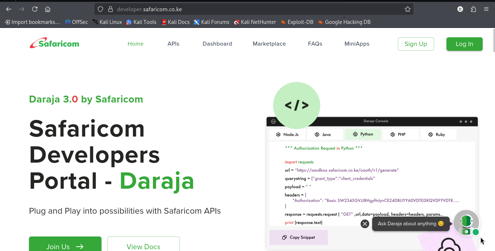
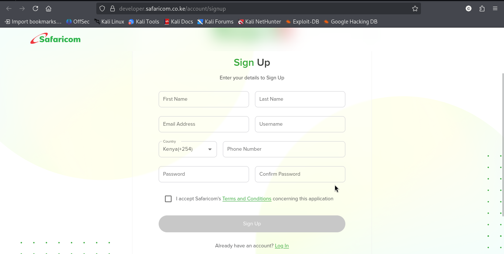
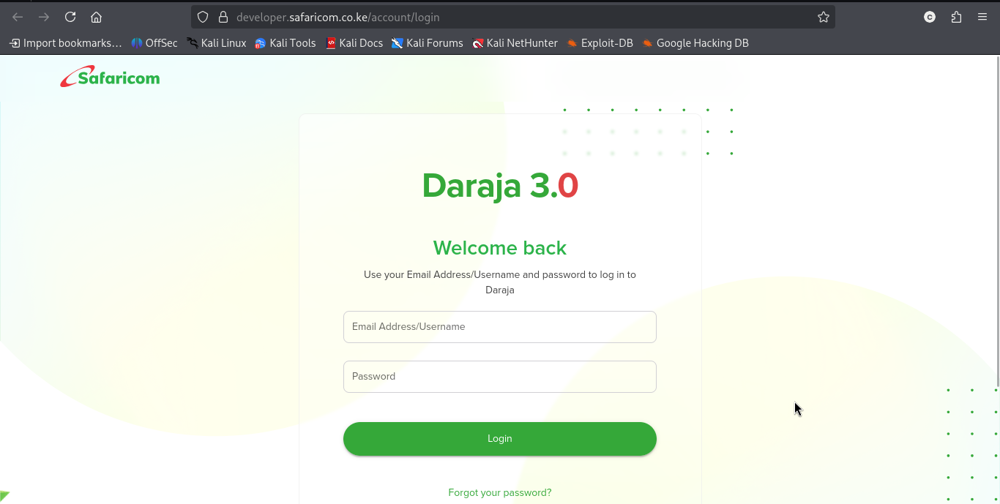
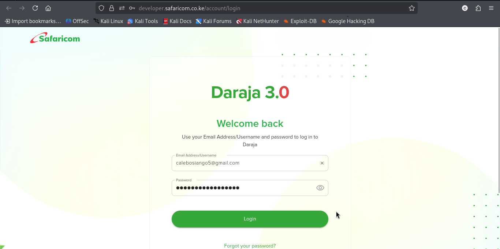
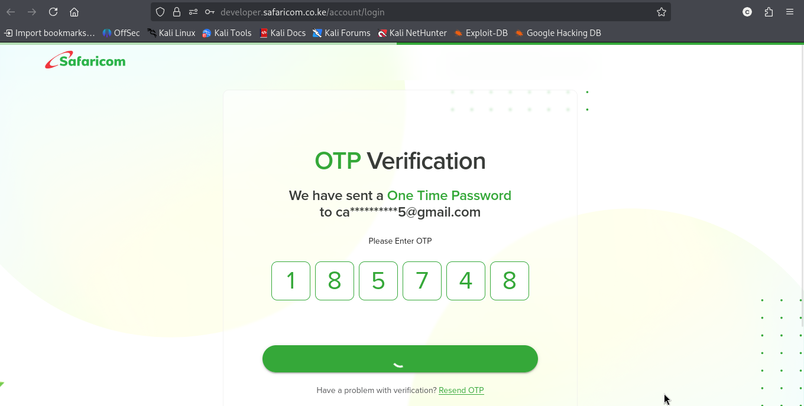
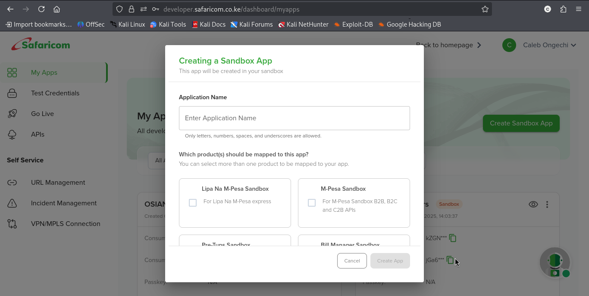
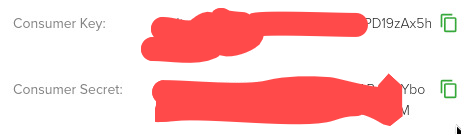

# M-Pesa API Integration with Native PHP

A beginner-friendly, zero-dependency PHP implementation for integrating Safaricom's **Daraja 2.0 API**. This repository is specifically structured to help new developers understand the core mechanics of M-Pesa mechanics without the abstraction of complex frameworks or external packages.

## 🛠 Features Covered
1. **OAuth Authentication** (`generate_token.php`) - Generating transient access tokens.
2. **Lipa Na M-Pesa Online / STK Push** (`stk_push.php`) - Instantly prompting users for their PIN on their handset.
3. **Asynchronous Webhook Callbacks** (`callback_url.php`) - Safely parsing transaction response streams.
4. **C2B Simulation** (`c2b_simulate.php`) - Simulating payments locally for testing setup logic.

---

## 📂 Project Architecture

```text
├── .env.example          <-- Copy this to create your `.env` configuration file
├── config.php            <-- Core system constants, environments, and URL parameters
├── generate_token.php    <-- Handles access token authorization handshakes
├── stk_push.php          <-- Triggers automated Express STK Push queries
├── callback_url.php      <-- Processes live transactional webhook feedback from Safaricom
└── c2b_simulate.php      <-- Mock simulation tool for testing sandbox payloads
```

---

##  Setup & Installation Instructions

### Step 1: Clone the Project
Get these files onto your local development machine:
```bash
git clone https://github.com
cd Mpesa-intergration-using-php
```

### Step 2: Configure Keys & Settings
Follow this exact order on the portal to get your sandbox development keys:

1. **Visit the Portal Landing Page:** Open the [Safaricom Daraja Portal](https://safaricom.co.ke). This is the first page you encounter.
   

2. **Create an Account:** If you are a new developer, click the sign up button to register your profile.
   

3. **Sign In to Your Dashboard:** Use your validated credentials to log into your account interface.
   

4. **Review Account Details:** Check your developer dashboard profiles and settings.
   

5. **Complete Security Verification:** Complete any verification popups or authorization sequences required by the portal.
   

6. **Create Your App:** Go to **My Apps**, click create, select your API permission options, and finalize the application setup.
   

7. **Extract Your Production Keys:** Click your new app profile to reveal and copy your active sandbox parameters.
   

> 💡 **Tip:** Default credentials for Safaricom's public sandbox Paybill (`174379`) and its corresponding Passkey are already pre-filled in your `config.php` file for immediate testing.

---

## 🌐 Handling The Callback URL (The Trickiest Part)

Safaricom servers cannot send real-time payment confirmations to your local computer via `localhost`. Your callback handler script must be exposed securely to the internet via a public `HTTPS` URL.

### Setting Up a Tunnel with Ngrok:
1. Download and install [Ngrok](https://ngrok.com).
2. Boot up your local PHP web server (e.g., using XAMPP or running `php -S localhost:8000`).
3. Run the following command in your terminal window:
   ```bash
   ngrok http 8000
   ```
4. Ngrok will generate a secure random public URL that looks like this:
   `https://ngrok-free.app`
5. Copy that URL string, append `/callback_url.php` to it, and use it as your **`CALLBACK_URL`** configuration value inside your `config.php` file:
   ```php
   define('CALLBACK_URL', 'https://ngrok-free.app');
   ```

---

## 🧪 Testing Your Work

Once your web server is running and Ngrok is activated, you can execute individual files directly using your browser or via the terminal interface to monitor network feedback:

* **Generate an Authentication Token:**
  ```bash
  php generate_token.php
  ```
* **Initiate an Express STK Push Confirmation Request:**
  * Open `stk_push.php`.
  * Swap out the test target phone number configuration inside the bottom execution block with your personal active M-Pesa phone number.
  * Run the file:
    ```bash
    php stk_push.php
    ```
  * Keep an eye on your mobile device; an interactive overlay prompt requesting your sandbox PIN will appear shortly!

### Inspecting Incoming Webhook Payloads
When a customer completes or cancels a transaction on their phone, Safaricom drops a JSON data stream into `callback_url.php`. 

Our boilerplate code automatically dumps raw logs directly into a new project log file named **`MpesaResponse.json`**. Review this generated log file anytime to evaluate how successful transaction objects are mapped.

---

## 🛑 Production Warnings & Reminders
* Always check the physical production dashboard definitions before deployment.
* **Never commit active live production application keys** to a public GitHub repository. 
* Remember to switch `MPESA_ENV` within `config.php` from `'sandbox'` over to `'production'` when migrating servers.
